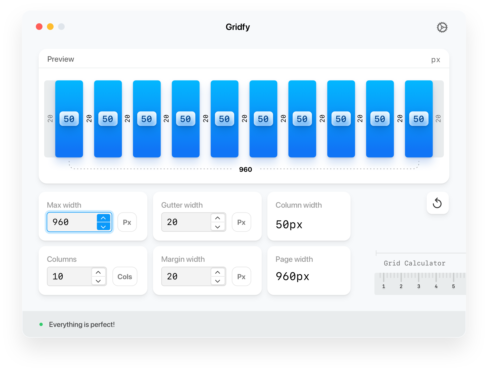

<h1 align="center">
   Gridfy
</h1>

Build the perfect layout for your site or application. 
Calculate column widths quickly and get correct results. Gridfy is tailored for you - a creative and ambitious professional.

## Features:

- Calculating column and page widths

- Error notification

- Two result modes

- Dark and light mode

- Smooth animation

- Works offline

- Optimised for Macs with Apple Silicon (M1, M2)

- Works great on macOS 13 Ventura

## Screenshots:

    
    
    

    
    
    

